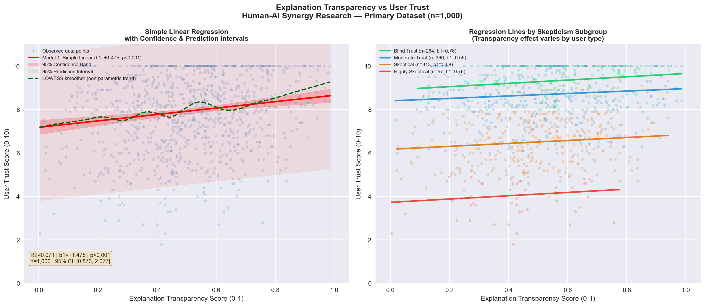
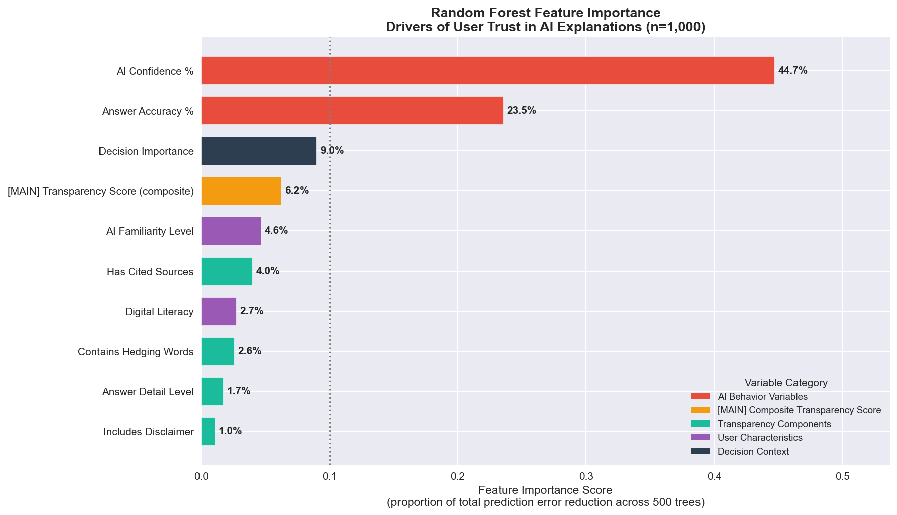
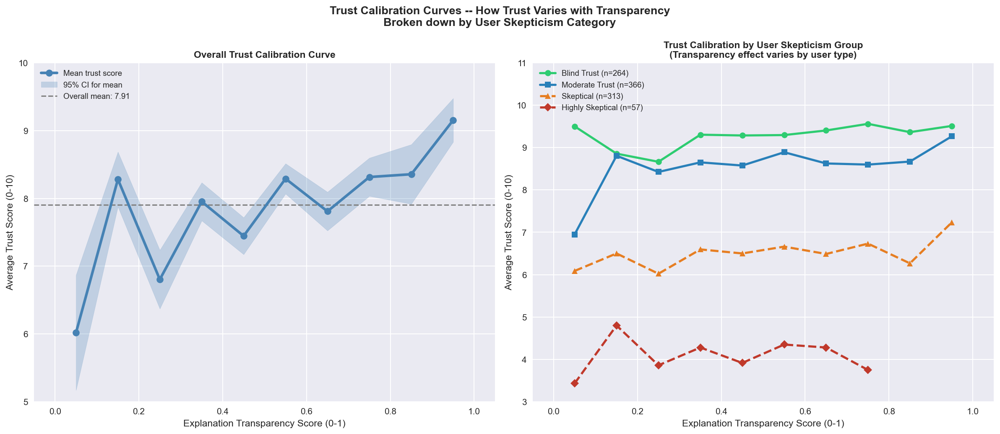
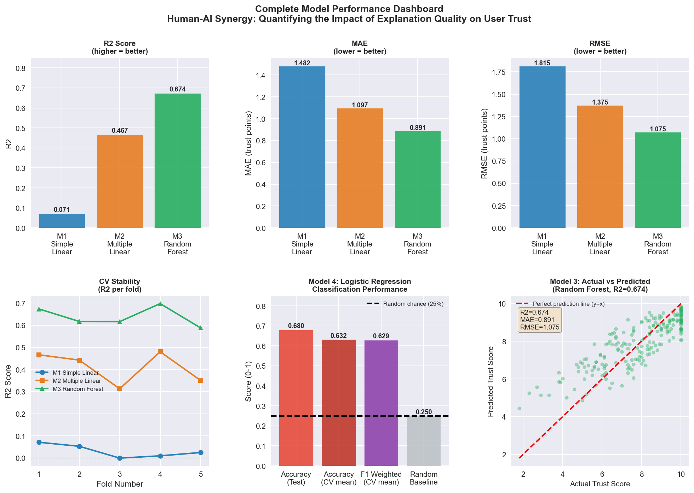
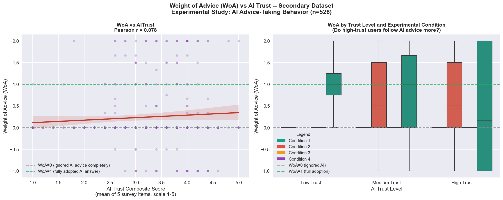
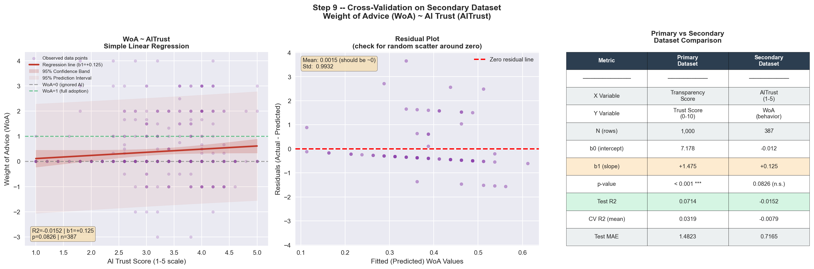

# Human-AI Synergy: Quantifying the Impact of Explanation Quality on User Trust


An end-to-end data science research project investigating whether AI explanation transparency drives human trust — and whether that trust actually changes behavior. The project combines **machine learning** (Random Forest, regularized regression, classification), **inferential statistics** (OLS with p-values and confidence intervals, hypothesis testing), and a **behavioral science framework** (Weight of Advice) across **two independent datasets**, including a cross-dataset validation that most XAI studies skip.

> *"Technical accuracy alone is insufficient for AI adoption — how AI communicates confidence matters more than how it structures its explanations."*

---

## TL;DR — What This Project Demonstrates

| | |
|---|---|
| **Research question** | Does AI explanation transparency increase user trust, and does stated trust predict actual advice-following behavior? |
| **Data** | 1,000 AI interaction records (CSV, 23 variables) + 526 human-subject experimental records (SPSS `.sav`, 158 variables, sourced from the Open Science Framework) |
| **Methods** | 9-step pipeline: acquisition → inspection → cleaning → feature engineering → EDA → 4 ML models → evaluation → visualization → cross-dataset behavioral validation |
| **Best model** | Random Forest — **R² = 0.674** on the test set, confirmed by 5-fold CV (**R² = 0.639**), generalization gap < 0.10 (no overfitting) |
| **Headline finding** | Transparency significantly predicts *stated* trust (β = +1.475, p < 0.001), but stated trust does **not** significantly predict *behavior* (r = 0.078, p = 0.083) — a measurable **attitude–behavior gap** |
| **Stack** | Python 3.13, pandas, NumPy, scikit-learn, statsmodels, SciPy, pyreadstat, matplotlib, seaborn |

---

## Research Question & Hypotheses

> *Does higher AI explanation transparency lead to higher user trust — and does that trust actually change behavior?*

Three formal hypotheses were tested at α = 0.05 using two-tailed t-tests from statsmodels OLS output:

| Hypothesis | Test | Result | Verdict |
|---|---|---|---|
| **H1:** Transparency → higher stated trust | Simple Linear Regression (n = 1,000) | β₁ = +1.475, p < 0.001, 95% CI [0.873, 2.077] | ✅ **Supported** |
| **H2:** Transparency effect survives controls | Multiple Linear Regression (partial coefficient) | β = +0.652, p = 0.008 | ✅ **Supported** |
| **H3:** Stated trust → advice-following behavior (WoA) | OLS on secondary behavioral dataset (n = 387) | b₁ = +0.125, p = 0.083, R² = −0.015 | ❌ **Not supported** |

The rejection of H3 is the project's most important result: it empirically tests the **transparency → trust → behavior** chain that XAI research usually assumes but rarely verifies.

---

## Key Findings

1. **Transparency significantly predicts stated trust** — β = +1.475 (p < 0.001): each unit increase in explanation transparency raises trust by ~1.5 points on a 10-point scale. The effect remains significant (β = +0.652, p = 0.008) after controlling for AI performance metrics and user characteristics.
2. **AI Confidence Percentage is the #1 trust driver** — 44.7% of Random Forest feature importance, nearly double Answer Accuracy (23.5%) and more than 7× the composite Transparency Score (6.2%). *How confident the AI sounds matters more than how it explains itself.*
3. **Attitude–behavior gap discovered** — stated trust barely correlates with actual advice-following (r = 0.078, p = 0.083). People who *report* high trust don't necessarily *act* on AI advice. A residual analysis confirmed this is a genuine null relationship, not model misspecification.
4. **Experience breeds skepticism** — AI Familiarity (β = −0.142, p < 0.001) and Digital Literacy (β = −0.118, p < 0.001) *negatively* predict trust: experienced users demand evidence, not confidence signals.
5. **The transparency effect is heterogeneous** — it primarily moves Moderate Trust users (n = 366, trust rises 6.9 → 8.9 across the transparency range), while Blind Trust users (n = 264) stay near 9.0–9.5 and Highly Skeptical users (n = 57) stay near 3.5–4.5 regardless of explanation quality.
6. **Model complexity pays off progressively** — R² climbed **7% → 47% → 67%** from simple regression to Random Forest, showing the trust relationship is non-linear and multivariate.

---

## Results

### 1. The Core Relationship: Transparency → Trust



Simple Linear Regression (n = 1,000) with 95% confidence and prediction intervals; a LOWESS smoother confirms the linear trend. Transparency is a statistically significant but modest standalone predictor (R² = 0.071) — which motivated the multivariate models below.

### 2. What Actually Drives Trust: Feature Importance



AI behavioral signals (confidence + accuracy = **68.2%** combined importance) dominate structural explanation features. The engineered transparency composite ranks 4th.

| Rank | Feature | Importance |
|---|---|---|
| 1 | AI Confidence Percentage | 44.7% |
| 2 | Answer Accuracy Percentage | 23.5% |
| 3 | Decision Importance | 9.0% |
| 4 | Transparency Score (engineered composite) | 6.2% |
| 5 | AI Familiarity Level | 4.6% |
| 6 | Has Cited Sources | 4.0% |
| 7 | Digital Literacy | 2.7% |
| 8 | Contains Hedging Words | 2.6% |
| 9 | Answer Detail Level | 1.7% |
| 10 | Includes Disclaimer | 1.0% |

### 3. Not All Users Respond the Same: Trust Calibration by Skepticism Group



Transparency improvements primarily benefit the **Moderate Trust** segment — the largest (36.6%) and most malleable group — while users with extreme prior dispositions are largely immovable in either direction.

### 4. Four Models Compared: Performance Dashboard



Six-panel dashboard: R² / MAE / RMSE comparisons, per-fold cross-validation stability, classification metrics, and an actual-vs-predicted scatter for the best model.

| Model | Type | Test R² | CV R² | Test MAE | RMSE |
|---|---|---|---|---|---|
| M1 | Simple Linear Regression | 0.071 | 0.032 | 1.482 | 1.815 |
| M2 | Multiple Linear Regression | 0.467 | 0.411 | 1.097 | 1.376 |
| **M3 ★** | **Random Forest Regressor (best)** | **0.674** | **0.639** | **0.891** | **1.075** |
| M4 | Logistic Regression (classifier) | 68.0% acc. | 63.2% | — | F1 = 0.629 |

- Random Forest was stable across all 5 CV folds (R² range 0.588–0.698) — its performance is not an artifact of a lucky train/test split.
- All regression models showed generalization gaps (Test R² − CV R²) **below 0.10**, confirming no overfitting.
- The classifier predicts user skepticism type at 68% accuracy vs. a 25% random baseline — **2.7× better than chance**.

### 5. The Attitude–Behavior Gap: Does Stated Trust Predict Action?



The regression of behavior (WoA) on stated trust is nearly flat: **WoA = −0.012 + 0.125 × AITrust** (r = 0.078, p = 0.083, Test R² = −0.015 — worse than predicting the mean). The WoA distribution is bimodal, concentrated at exactly 0 (ignored the AI) and exactly 1 (fully adopted the AI), with a mean of ~0.42.

### 6. Cross-Dataset Validation (Step 9)



Left: the WoA ~ AITrust regression (n = 387). Center: residual plot with random scatter around zero, confirming the regression assumptions hold — the null result reflects a genuine absence of a trust→behavior relationship, not model misspecification. Right: side-by-side comparison of the primary and secondary dataset regressions.

---

## The Weight of Advice (WoA) Framework

WoA is a behavioral measure from judgment and decision-making research (Yaniv & Kleinberger, 2000) that captures what users *do*, not what they *say*:

```
WoA = (Final Judgment − Initial Judgment) / (AI Recommendation − Initial Judgment)
```

| WoA Value | Meaning |
|---|---|
| 0 | Completely ignored the AI |
| 0.5 | Split the difference equally |
| 1 | Fully adopted the AI's recommendation |
| < 0 | Moved *away* from the AI (reactance) |
| > 1 | Overcorrected past the AI's answer |

Applying WoA to an independent behavioral dataset is what allowed this project to separate **stated trust** (survey responses) from **behavioral trust** (actual decision updating) — and to discover that the two barely correlate.

---

## Methodology: The 9-Step Pipeline

| Step | What Was Done | Key Decisions & Tools |
|---|---|---|
| **1. Data Acquisition** | Loaded primary CSV (1,000 × 23) and secondary SPSS `.sav` (526 × 158) with variable/value label metadata | pandas, pyreadstat |
| **2. Data Inspection** | Shape, dtypes, missing-value audit, SPSS metadata review | pandas |
| **3. Data Cleaning** | Median imputation for continuous variables (robust to outliers), mode imputation for categoricals; IQR-fence outlier detection (Q1/Q3 ± 1.5×IQR) — impossible values removed, legitimate statistical outliers retained; label encoding | pandas, SciPy |
| **4. Feature Engineering** | Built a 5-component **Explanation Transparency Score** (AI confidence %, cited sources, hedging words, disclaimer, answer detail) — each component min-max normalized to 0–1, then equal-weight averaged into a composite. Computed **WoA** on the secondary dataset, removing division-by-zero cases (AI score = initial judgment), retaining 387 of 526 rows. Built **AITrust** (5-item) and **PerceivedExpertise** (4-item) Likert composites | NumPy, scikit-learn |
| **5. EDA** | Correlation matrix (transparency↔trust r = 0.27, p < 0.001; AI confidence↔trust r = 0.62), distribution analysis, trust calibration by skepticism subgroup, bimodal WoA exploration — all before any modeling, to avoid data snooping | matplotlib, seaborn |
| **6. Modeling** | Progressive strategy: Simple LR → Multiple LR → Random Forest (500 trees) → Logistic Regression classifier. 80/20 train-test split; **stratified** splitting for classification to protect the small Highly Skeptical class (n = 57) | scikit-learn, statsmodels |
| **7. Evaluation** | R², MAE, RMSE, 5-fold cross-validation, generalization-gap analysis, confusion matrix, classification report, residual diagnostics | scikit-learn |
| **8. Visualization** | 5 publication-ready figures (confidence/prediction bands, importance rankings, calibration curves, 6-panel model dashboard, behavioral validation) | matplotlib, seaborn |
| **9. Behavioral Validation** | Cross-dataset test of the trust → behavior link: OLS of WoA on AITrust with residual analysis confirming assumptions held — the null result is genuine, not misspecification | SciPy, statsmodels |

---

## Datasets

| | Primary | Secondary |
|---|---|---|
| **Source** | Published CSV dataset | Open Science Framework (OSF) — human-subject lunar estimation experiment |
| **Size** | 1,000 rows × 23 columns | 526 rows × 158 columns (387 WoA-valid after filtering) |
| **Format** | CSV | SPSS `.sav` (read via pyreadstat with full metadata) |
| **Target** | `user_trust_score` (0–10) | WoA (continuous behavioral measure) |
| **Role** | Model stated trust | Validate whether stated trust predicts real behavior |

---

## Tech Stack

| Tool | Purpose |
|---|---|
| Python 3.13 | Core language |
| pandas / NumPy | Data manipulation and numerical operations |
| scikit-learn | ML models, preprocessing, cross-validation, metrics |
| statsmodels | Inferential regression output (p-values, confidence intervals) |
| SciPy | Z-scores, normality tests, correlation testing |
| pyreadstat | Reading SPSS `.sav` files with metadata |
| matplotlib / seaborn | Publication-ready visualizations |
| Jupyter Notebook | Interactive development and reproducible analysis |

---

## Repository Structure

```
human-ai-synergy-project/
│
├── DSProject_1.ipynb                                  # Main Jupyter Notebook (full 9-step pipeline)
├── DSProject 1.pdf                                    # Exported PDF with all outputs
├── Shivam_Thakkar_CS628_Final_Presentation.pptx       # Final presentation slides
│
├── Data/
│   ├── ai_skepticism_dataset.csv                      # Primary dataset (1,000 rows × 23 columns)
│   └── Study 2 Data Syntax and Outputs/
│       └── AI and Decision Making_FINAL_dataset.sav   # Secondary SPSS dataset (526 rows)
│
└── images/
    ├── fig1_regression_confidence_bands.png           # Core transparency–trust relationship
    ├── fig2_feature_importance.png                    # Random Forest feature importance
    ├── fig3_trust_calibration_curve.png               # Trust calibration by skepticism group
    ├── fig4_model_dashboard.png                       # All 4 models compared
    ├── fig5_woa_aitrust.png                           # WoA behavioral validation
    └── fig6_step9_cross_dataset_validation.png        # Cross-dataset validation (Step 9)
```

---

## How to Run

1. **Clone the repository**
```bash
git clone https://github.com/shivthakkar/human-ai-synergy-project.git
cd human-ai-synergy-project
```

2. **Install dependencies**
```bash
pip install pandas numpy matplotlib seaborn scikit-learn pyreadstat scipy statsmodels
```

3. **Update file paths** in the notebook (Cells 2–3) to match your local directory

4. **Open in Jupyter or VS Code** and run all cells sequentially

---

## Implications for AI Design

- **Calibrate confidence displays** — the AI's expressed confidence is the single strongest trust lever (44.7% importance), which makes *miscalibrated* confidence a serious design risk
- **Design for behavior, not just felt trust** — the attitude–behavior gap means trust surveys overstate real adoption; behavioral nudges are needed to convert stated trust into advice-following
- **Segment your users** — transparency investments pay off most for moderate-trust users; extreme-disposition users need different interventions entirely
- **Serve experienced users with evidence** — high-literacy, AI-familiar users discount confidence signals and require substantive justification

---

## Limitations & Future Research

- The Highly Skeptical subgroup was small (n = 57), constraining subgroup statistical power and classification performance for that class
- The secondary dataset used a single low-stakes estimation task; replication with real organizational decisions is a natural next step
- Planned extensions: personality variables (Big Five) as trust moderators, non-linear/interaction trust models, cognitive load and domain expertise measures, and longitudinal tracking of trust calibration over time

---

## References

1. Ebermann, C., Selisky, M., & Weibelzahl, S. (2023). Explainable AI: The effect of contradictory decisions and explanations on users' acceptance. *International Journal of Human-Computer Interaction, 39*(9), 1807–1826.
2. Jiang, L., et al. (2023). Who should be first? How and when AI-human order influences procedural justice. *PLoS ONE, 18*(7), e0284840.
3. Lai, V., Chen, C., Smith-Renner, A. M., Liao, Q. V., & Tan, C. (2023). Towards a science of human-AI decision making. *FAccT '23 Proceedings.*
4. Neri, G., et al. (2025). Data visualization in AI-assisted decision-making: A systematic review. *Frontiers in Communication, 10*, 1605655.
5. Wen, Y., Wang, J., & Chen, X. (2025). Trust and AI weight: Human-AI collaboration in organizational management decision-making. *Frontiers in Organizational Psychology, 3*, 1419403.
6. Yaniv, I., & Kleinberger, E. (2000). Advice taking in decision making: Egocentric discounting and reputation formation. *Organizational Behavior and Human Decision Processes, 83*(2), 260–281.

---

## Connect

**LinkedIn:** [linkedin.com/in/shivamthakkar](https://linkedin.com/in/shivamthakkar)
**GitHub:** [github.com/shivthakkar](https://github.com/shivthakkar)
